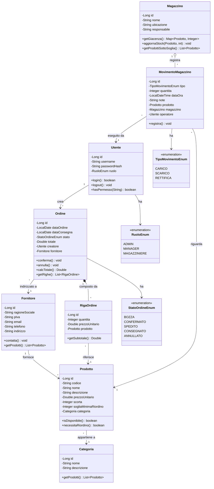

# SGF - Sistema Gestione Forniture

## Class Diagram UML



## Stack Tecnologico

| Layer | Tecnologia |
|---|---|
| Frontend | Angular 17+ + Angular Material |
| Backend | Java 17 + Spring Boot 3 |
| Persistenza | JPA/Hibernate + MySQL |
| Build | Maven (backend) + npm (frontend) |
| Test | JUnit 5 + Mockito |
| Documentazione API | Swagger / OpenAPI |

## Struttura del progetto

```
sgf/
├── backend/                  # Spring Boot
│   ├── src/main/java/
│   │   └── com/sgf/
│   │       ├── controller/
│   │       ├── service/
│   │       ├── repository/
│   │       ├── model/
│   │       ├── dto/
│   │       └── exception/
│   └── pom.xml
└── frontend/                 # Angular
    ├── src/app/
    │   ├── core/
    │   ├── features/
    │   └── shared/
    └── package.json
```
