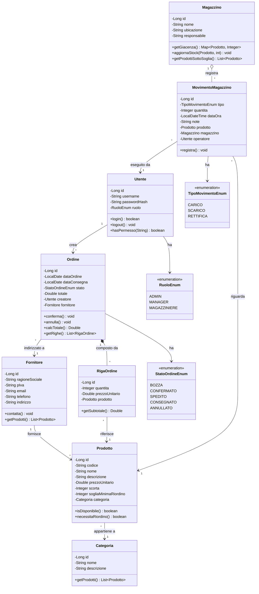

# SGF - Sistema Gestione Forniture

## Class Diagram UML



## Stack Tecnologico

| Layer | Tecnologia |
|---|---|
| Frontend | Angular 17+ + Angular Material |
| Backend | Java 17 + Spring Boot 3 |
| Persistenza | JPA/Hibernate + MySQL |
| Build | Maven (backend) + npm (frontend) |
| Test | JUnit 5 + Mockito |
| Documentazione API | Swagger / OpenAPI |

## Struttura del progetto

```
sgf/
├── backend/                  # Spring Boot
│   ├── src/main/java/
│   │   └── com/sgf/
│   │       ├── controller/
│   │       ├── service/
│   │       ├── repository/
│   │       ├── model/
│   │       ├── dto/
│   │       └── exception/
│   └── pom.xml
└── frontend/                 # Angular
    ├── src/app/
    │   ├── core/
    │   ├── features/
    │   └── shared/
    └── package.json
```

## Use Case Diagram UML

```mermaid
flowchart TD
    %% Attori
    MAG([🧑 Magazziniere])
    MAN([👔 Manager])
    ADM([🔧 Admin])

    %% System boundary simulata con subgraph
    subgraph SGF [Sistema Gestione Forniture]

        %% Use cases condivisi
        UC0([Autenticazione])

        %% Magazziniere
        UC1([Visualizza prodotti])
        UC2([Registra movimento])
        UC3([Verifica scorte])
        UC4([Notifica sottoscorta])
        UC5([Gestisci ordini fornitore])

        %% Manager
        UC6([Approva ordine])
        UC7([Gestisci fornitori])
        UC8([Gestisci prodotti])
        UC9([Visualizza report])
        UC10([Esporta report])

        %% Admin
        UC11([Gestisci utenti])
        UC12([Configura sistema])

        %% Relazioni include / extend
        UC2 -->|«include»| UC3
        UC3 -.->|«extend»| UC4
        UC5 -->|«include»| UC6
        UC9 -.->|«extend»| UC10
    end

    %% Associazioni Magazziniere
    MAG --- UC0
    MAG --- UC1
    MAG --- UC2
    MAG --- UC3
    MAG --- UC5

    %% Associazioni Manager
    MAN --- UC0
    MAN --- UC6
    MAN --- UC7
    MAN --- UC8
    MAN --- UC9

    %% Associazioni Admin
    ADM --- UC0
    ADM --- UC11
    ADM --- UC12

    %% Stili
    style SGF fill:#f8f9fa,stroke:#adb5bd,stroke-width:1.5px,color:#212529
    style UC0 fill:#e9ecef,stroke:#868e96,color:#212529
    style UC1 fill:#d3f9d8,stroke:#2f9e44,color:#1a3a1f
    style UC2 fill:#d3f9d8,stroke:#2f9e44,color:#1a3a1f
    style UC3 fill:#d3f9d8,stroke:#2f9e44,color:#1a3a1f
    style UC4 fill:#fff3bf,stroke:#f59f00,color:#5c3d00
    style UC5 fill:#d3f9d8,stroke:#2f9e44,color:#1a3a1f
    style UC6 fill:#d0ebff,stroke:#1971c2,color:#0d2e5e
    style UC7 fill:#d0ebff,stroke:#1971c2,color:#0d2e5e
    style UC8 fill:#d0ebff,stroke:#1971c2,color:#0d2e5e
    style UC9 fill:#d0ebff,stroke:#1971c2,color:#0d2e5e
    style UC10 fill:#fff3bf,stroke:#f59f00,color:#5c3d00
    style UC11 fill:#ffd8a8,stroke:#e8590c,color:#5c1a00
    style UC12 fill:#ffd8a8,stroke:#e8590c,color:#5c1a00
```



### Legenda

| Colore | Significato |
|---|---|
| 🟢 Verde | Funzionalità Magazziniere |
| 🔵 Blu | Funzionalità Manager |
| 🟠 Arancione | Funzionalità Admin |
| 🟡 Giallo | «extend» — opzionale/condizionale |
| ⚪ Grigio | Condiviso da tutti |

### Relazioni

| Tipo | Significato |
|---|---|
| `→` «include» | Il caso d'uso base include sempre quello secondario |
| `-.->` «extend» | Il caso d'uso secondario si attiva solo in certi casi |


